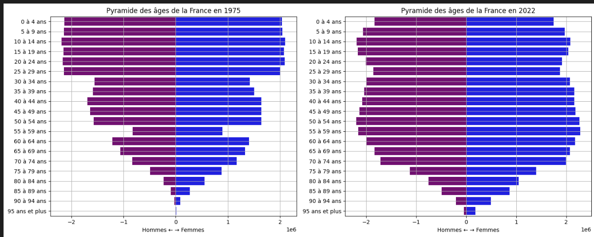
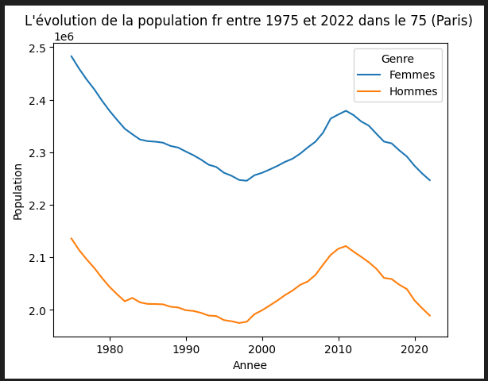

# Analyse Démographique de la Population Française (1975-2023)

## 📌 Présentation du Projet
Le but de ce projet est de réaliser une analyse statistique rapide à partir d'un jeu de données démographiques complexe. Le format source (Excel multi-onglets) n'est pas directement optimisé pour une analyse avec Python et nécessite une étape importante de **Data Cleaning** et de **Restructuration (Reshaping)**.

Nous nous concentrons sur l'estimation de la population au 1er janvier de chaque année. Ces données sont calculées par l'INSEE à partir des recensements et de modèles d'évolution de la population.

## 📊 Source des Données
Les données sont mises à disposition par l'**Insee** (Institut national de la statistique et des études économiques).

* **Page de référence :** [Insee - Estimations de population](https://www.insee.fr/fr/statistiques/1893198)
* **Téléchargement direct :** [estim-pop-dep-sexe-aq-1975-2023.xls](https://www.insee.fr/fr/statistiques/fichier/1893198/estim-pop-dep-sexe-aq-1975-2023.xls)

## 🛠️ Méthodologie Technique
Le projet transforme un fichier Excel complexe en un DataFrame "Tidy" (format long) pour permettre :
1.  **Le Pivotage (Melt) :** Passage d'un format large (années/âges en colonnes) à un format long (lignes par catégorie).
2.  **L'Analyse Temporelle :** Visualisation de l'évolution par département et par genre.
3.  **La Pyramide des Âges :** Génération automatique de graphiques de structure de population.
4.  **La Cartographie (SIG) :** Jointure avec des fichiers GeoJSON pour visualiser la densité et la croissance par région.




## 🚀 Installation et Utilisation
### Prérequis
Assurez-vous d'avoir installé les bibliothèques suivantes :
```bash
pip install pandas matplotlib geopandas seaborn xlrd
